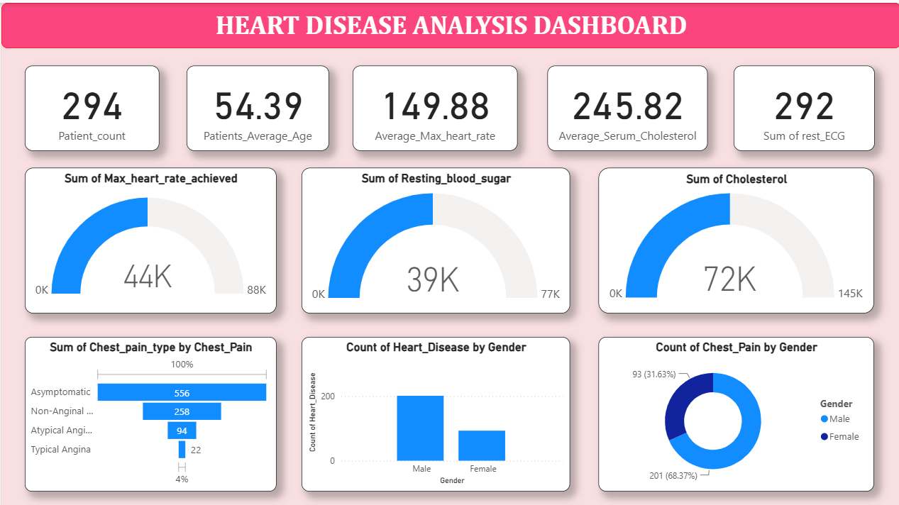
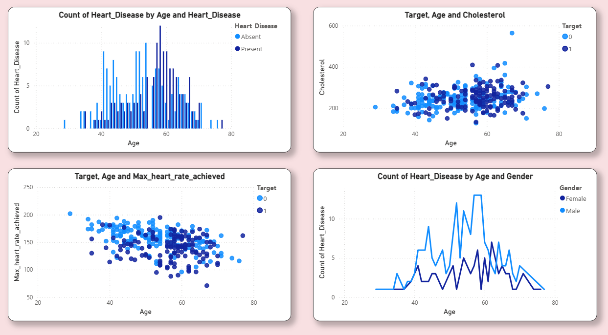
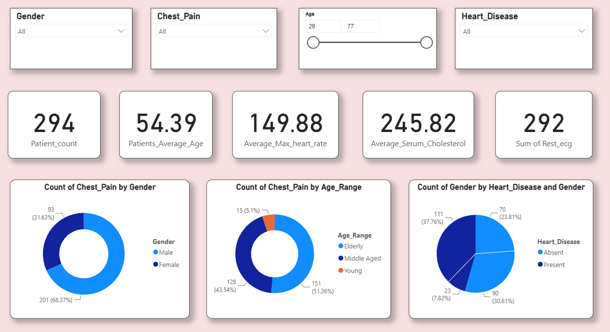

# 🫀 Heart Disease Analysis Dashboard

A Power BI dashboard built to explore clinical risk factors and demographic patterns linked to heart disease, enabling data-driven insights for early detection and preventive healthcare decisions.

---

## 🛠️ Tech Stack

- **Power BI** — Dashboard design, DAX measures, and interactive slicers
- **Excel / CSV** — Data cleaning and preparation

---

## 📂 Data Source

Based on the [UCI Heart Disease Dataset](https://archive.ics.uci.edu/ml/datasets/Heart+Disease) — 294 patient records with clinical attributes including age, gender, chest pain type, cholesterol, resting ECG, and max heart rate.

---

## ✨ Highlights & Features

- **KPI Cards** — Instant view of patient count, average age, heart rate, and cholesterol
- **Chest Pain Breakdown** — Distribution across Asymptomatic, Non-Anginal, Atypical Anginal, and Typical Angina types
- **Age Trend Analysis** — Scatter and line charts revealing how age correlates with heart rate, cholesterol, and disease presence
- **Gender & Age Range Segmentation** — Donut charts comparing male vs. female and Young / Middle-Aged / Elderly cohorts
- **Interactive Filters** — Slicers for Gender, Chest Pain, Age range, and Heart Disease status for dynamic exploration

---

## 📈 Business Impact & Insights

- 🔺 **High-risk age group identified** — Heart disease cases peak between ages **55–65**, supporting targeted screening programs
- 👥 **Gender disparity** — Males account for **68%** of patients, indicating higher cardiovascular risk in men
- ⚠️ **Silent majority** — **60% of patients report asymptomatic chest pain**, highlighting the danger of undetected heart conditions
- 📊 **Middle-aged dominance** — Over **51%** of chest pain cases fall in the middle-aged group, pointing to a critical intervention window
- 💡 Insights can guide hospitals and health insurers in **prioritizing resources, risk stratification, and preventive care planning**

---

## 📸 Dashboard Preview

